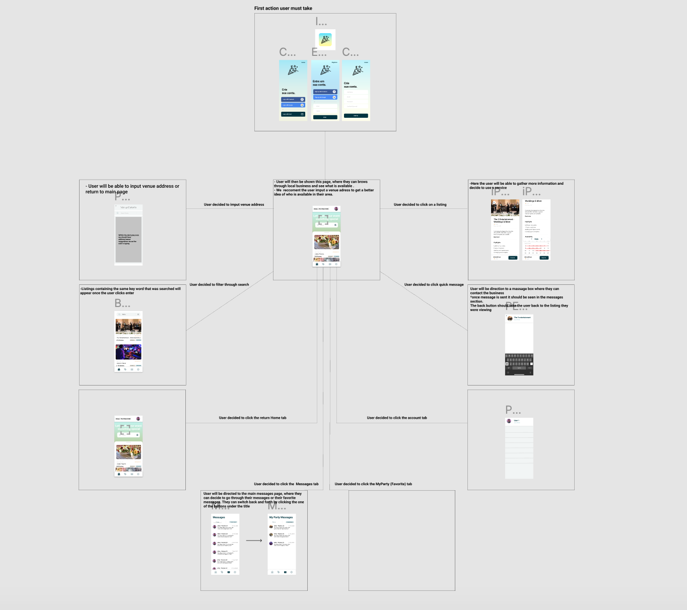
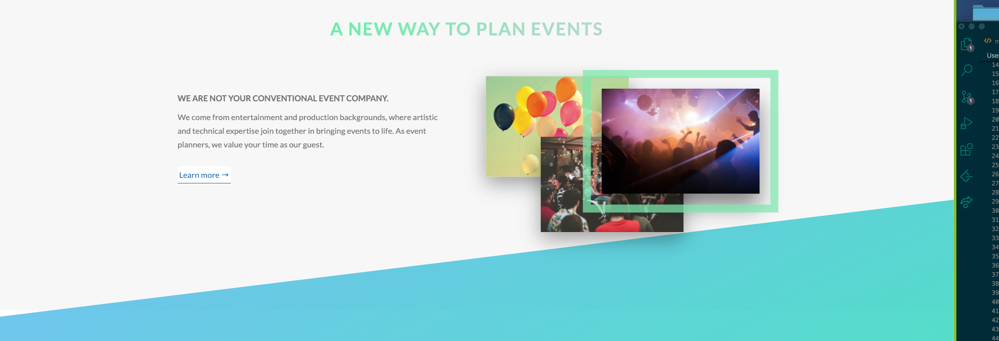
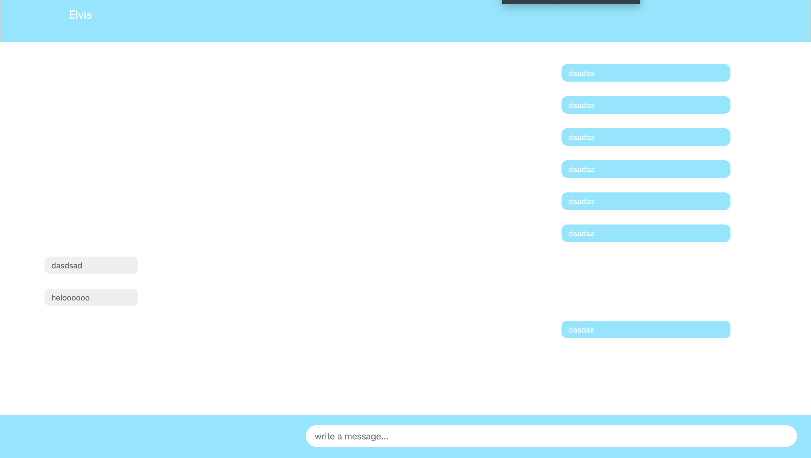

# EVENTFULL

At Eventfull, you a user are able to plan your events.
You can search for many different types of vendors that may be of interest in
planning your event.

The key point of Eventfull is to have an interactive 
and responsive experience when planning their event.

## Motivation

While brainstorming between one another we all started talking about different ideas and were rating which idea was best. Noah the business man was the group member who came up the idea of creating an app where users can create their events and the main feature would be that they can contact different vendors and speak to them through a messaging feature. More features are scheduled to be developed some time in the near future.


### Build Status

Integration kits we used:

```
Travis.ci
```

And repeat

```
eslinter
```

## Screenshots









## Technology Used
* Javascript
* HTML
* CSS
* JQuery
* Handlebars
* MYSQL
* Socket .io
* Sequalize
* Express
* Bootstrap

```

```

### Code Example

Explain what these tests test and why

```
Give an example
```

## Installation
```
npm i
```


## Authors

* **Noah Afalo** - *Group Member*
* **Caio Bueno** - *Group Member*
* **Fernando Aguilar** - *Group Member*
* **Elvis Lumnica** - *Group Member*


See also the list of [contributors](https://github.com/caioebueno/Eventfull/contributors) who participated in this project.


